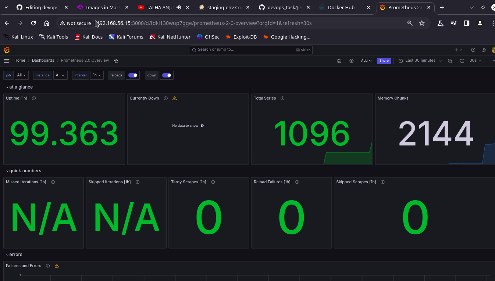

# DEVOPS-TASK DOCUMENTATION
[](https://travis-ci.org/joemccann/dillinger)

IT Boookstore is a react-project. I have used this project as test for my Devops project.
You can run my project by running in Docker by pulling image link below:
```
docker pull monkeydmagnas007/staging_task:latest
#or
docker pull monkeydmagnas007/development_task:latest
#and 
docker run -idt -p 3000:3000 monkeydmagnas007/development_task:latest
#make sure 3000 port is available
```

### 1. Git Repository Setup

Structure:

•Main branches: development, staging, production.

•Feature branches for each task.

Branching Strategy:

•development: Active development, integration testing.

•staging: Pre-release testing.

•production: Live environment.

Steps:

•Set up a connection to the remote repository in command line using:
git remote add origin <repo_link>

•Create branches using:git checkout -b <new_branch>

### 2. Infrastructure with Vagrant

•Virtual Machines:

•ServerA as development, staging and production with different ports defined . \

  • Base Image: centos/07 \
  • Hostname: development \
  • Private IP: 192.168.56.15 \
  • Memory: 2048

  •ServerB as database backup server

  • Base Image: centos/07 \
  • Hostname: Database_backup \
  • Private IP: 192.168.56.16 \
  • Memory: 2048

Download and Install Vagrant( https://developer.hashicorp.com/vagrant/install ). \
Create a new folder and open it in VS code. \
Create Vagrant file using:
```
vagrant init
```
Describe infrastructure in vagrant file:• \
Create the VMs using:
```
vagrant up
```
### 3. CI Pipeline Using Jenkins
•Pipeline: \
•Stages: \
• Git: host the code from ‘staging’ branch. \
• Build: build a docker image using Nginx: alpine as base image. \
• Push: push image to docker hub. \

Deployment:

Pull image from docker hub to the staging VM. \
Deploy the image on port 8080. \

• Steps: \
Install Docker: \
• Add Docker's official GPG key:
```
sudo apt-get update
sudo apt-get install ca-certificates curl
sudo install -m 0755 -d /etc/apt/keyringssudo curl -fsSL https://download.docker.com/linux/ubuntu/gpg -o
/etc/apt/keyrings/docker.asc
sudo chmod a+r /etc/apt/keyrings/docker.asc
```
•Add the repository to Apt sources:
```
echo \
"deb [arch=$(dpkg --print-architecture) signed-
by=/etc/apt/keyrings/docker.asc]
https://download.docker.com/linux/ubuntu \
$(. /etc/os-release && echo "$VERSION_CODENAME") stable" | \
sudo tee /etc/apt/sources.list.d/docker.list > /dev/null
sudo apt-get update
```
•Install the Docker packages:
```
sudo apt-get install docker-ce docker-ce-cli containerd.io docker-buildx-plugin docker-compose-plugin
```
• Run docker -v to see if its properly installed.
Install Jenkins on docker
• Create a bridge network in docker:
docker network create Jenkins
•
We need docker:dind in order to execute Docker commands inside
Jenkins node so:
```
docker run --name jenkins-docker --rm --detach \
--privileged --network jenkins --network-alias docker \
--env DOCKER_TLS_CERTDIR=/certs \
--volume jenkins-docker-certs:/certs/client \
--volume jenkins-data:/var/jenkins_home \
--publish 2376:2376 \
docker:dind --storage-driver overlay2
```
•Create a Docker file inside a folder to customize the official Jenkins
Docker Image:
```
mkdir Jenkins-dockervi Dockerfile
```
•Inside the Dockerfile:
```
FROM jenkins/jenkins:2.452.1-jdk17
USER root
RUN apt-get update && apt-get install -y lsb-release
RUN curl -fsSLo /usr/share/keyrings/docker-archive-
keyring.asc \
https://download.docker.com/linux/debian/gpg
RUN echo "deb [arch=$(dpkg --print-architecture) \
signed-by=/usr/share/keyrings/docker-archive-
keyring.asc] \
https://download.docker.com/linux/debian \
$(lsb_release -cs) stable" >
/etc/apt/sources.list.d/docker.list
RUN apt-get update && apt-get install -y docker-ce-cli
USER jenkins
RUN jenkins-plugin-cli --plugins "blueocean docker-workflow"
```
•Build a docker image from this Dockerfile:
```
docker build -t myjenkins-blueocean:2.452.1-1
```
•Run the image as a container:
```
docker run --name jenkins-blueocean --restart=on-failure --detach
\
--network jenkins --env DOCKER_HOST=tcp://docker:2376 \
--env DOCKER_CERT_PATH=/certs/client --env
DOCKER_TLS_VERIFY=1 \
--publish 8080:8080 --publish 50000:50000 \
--volume jenkins-data:/var/jenkins_home \
--volume jenkins-docker-certs:/certs/client:ro \myjenkins-blueocean:2.452.1-1
```
•Create the pipeline in Jenkins :

To have a build trigger use Poll SCM \
•Deploy the application on a staging environment using Docker:
```
docker run --name my-nginx-container -d -p 8080:80 monkeydmagnas007/staging-task:latest.
```
### 4. Monitoring with Prometheus and Grafana 
•Purpose: \
•Components: \
•Prometheus: Collects metrics from servers and applications. \
•Grafana: Provides dashboards for visualization. \
Implementation: \
Collects and visualizes system metrics. \
Implement jobs for Jenkins and Node exporter in Prometheus to gather system and Jenkins matrices. \
Using Prometheus as data source in Grafana to visualize and monitor the system. \
Security Measures: \
•RBAC: Restricts access to Grafana. \
•Encryption: Running Grafana server in https with self-signed SSL certificate for secure transmission. \
Steps:

•Installation of Prometheus

•Update System
```
sudo apt-get update
```
•Download Prometheus package
```
wget
https://github.com/prometheus/prometheus/releases/download/v2.27.1/prometheus-2.27.1.linux-amd64.tar.gz
```
•Add a Prometheus user, create needed directories and change the owner of those directories
```
sudo useradd --no-create-home --shell /bin/false Prometheus
sudo mkdir /etc/prometheus
sudo mkdir /var/lib/prometheus
sudo chown prometheus:prometheus /etc/prometheussudo chown prometheus:prometheus /var/lib/Prometheus
```
•Extract the Prometheus downloaded file and extract it
```
tar -xvzf prometheus-2.27.1.linux-amd64.tar.gz
```
•Rename it, copy “Prometheus” and “promtool” from that file to /usr/local/bin and change their ownership
```
sudo cp prometheuspackage/prometheus /usr/local/bin/
sudo cp prometheuspackage/promtool /usr/local/bin/
sudo chown prometheus:prometheus /usr/local/bin/Prometheus
sudo chown prometheus:prometheus /usr/local/bin/promtool
```
•Copy “consoles” and “console_libraries” to /etc/Prometheus and change their ownership
```
sudo cp -r prometheuspackage/consoles /etc/Prometheus
sudo cp -r prometheuspackage/console_libraries /etc/Prometheus
sudo chown -R prometheus:prometheus /etc/prometheus/consoles
sudo chown -R prometheus:prometheus
/etc/prometheus/console_libraries
```
•Create promethues.yml file
```
sudo vi /etc/prometheus/prometheus.yml
```
•Add following configuration
```
global:
scrape_interval: 10s
scrape_configs:
- job_name: 'prometheus_master'
scrape_interval: 5s
static_configs:
- targets: ['localhost:9090']
```
•Change the ownership of the filesudo chown prometheus:prometheus
```
/etc/prometheus/prometheus.yml
```
•Create Prometheus service file
```
sudo vi /etc/systemd/system/prometheus.service
```
•Copy the following content to the file
```
[Unit]
Description=Prometheus
Wants=network-online.target
After=network-online.target
[Service]
User=prometheus
Group=prometheus
Type=simple
ExecStart=/usr/local/bin/prometheus \
--config.file /etc/prometheus/prometheus.yml \
--storage.tsdb.path /var/lib/prometheus/ \
--web.console.templates=/etc/prometheus/consoles \
--web.console.libraries=/etc/prometheus/console_libraries
[Install]
WantedBy=multi-user.target
```
•Reload the system service, start Prometheus and check the status
```
sudo systemctl daemon-reload
sudo systemctl start Prometheus
sudo systemctl status Prometheus•
```
•Access Prometheus in web browser
```
http://Server-IP:9090/graph
```
Integrate Node Exporter with Prometheus \
•Create a system user for the installation.
```
sudo useradd -rs /bin/false node_exporter
```
•Download the latest node_exporter package.
```
wget
https://github.com/prometheus/node_exporter/releases/download/v
1.5.0/node_exporter-1.5.0.linux-arm64.tar.gz
```
•Extract & move the node_exporter package and rename the directory to ‘node_exporter’ \
```
sudo tar -xzvf node_exporter-1.5.0.linux-amd64.tar.gz
sudo mv node_exporter-1.5.0.linux-amd64/node_exporter
/usr/local/bin
```
•Add firewall rule to open port 9100 (if firewall is enabled)
```
sudo firewall-cmd --add-port=9100/tcp
sudo firewall-cmd –reload
```
•Create a file ‘/etc/systemd/system/node_exporter.service’ with following content
```
[Unit]Description=Node Exporter
[Service]
User=node_exporter
EnvironmentFile=/etc/sysconfig/node_exporter
ExecStart=/usr/local/bin/node_exporter $OPTIONS
[Install]
WantedBy=multi-user.target
```
•Reload system daemon and start node_exporter server
```
sudo systemctl daemon-reload
sudo systemctl start node_exporter.service
sudo systemctl status node_exporter.service
```
•Configure Prometheus to scrape metrics
```
sudo vi /etc/prometheus/prometheus.yml
```

Add following:
```
job_name: 'node_exporter_centos'
scrape_interval: 5s
static_configs:
- targets: ['server-ip:9100']
```
•Now we can see node_exporter on http://server-ip:9090/targets• \
•Install Grafana \
•Update server \
```
sudo apt-get update
```
•Add Grafana repository
```
sudo apt-get install -y apt-transport-https
sudo apt-get install -y software-properties-common wget
sudo wget -q -O /usr/share/keyrings/grafana.key
https://apt.grafana.com/gpg.key
echo "deb [signed-by=/usr/share/keyrings/grafana.key]
https://apt.grafana.com stable main" | sudo tee -a
/etc/apt/sources.list.d/grafana.list
```
•Add following contents:
```
[grafana]
name=grafana
baseurl=https://packages.grafana.com/oss/rpm
repo_gpgcheck=1
enabled=1
gpgcheck=1
gpgkey=https://packages.grafana.com/gpg.key
sslverify=1
sslcacert=/etc/pki/tls/certs/ca-bundle.crt
````
•Install Grafana
```
sudo apt-get install grafana
```
•Start Grafana Serversystemctl start grafana-server
```
systemctl status grafana-server
```
•Add Prometheus as data source in Grafana location \
•Role-Based Access Control in Grafana \
•Make users with different level of access control in Grafana \

### 5. MySQL Server Backup and Migration
•Backup Strategy: \
Migration: \
mysqldump for backup. \
Crontab to trigger mysqldump for timely backup. \
File compression: gzip to compress backup file. \
Secure Copy Protocol (SCP) for file transfer \
Steps:

•Create a shell script named databse_backup.sh and inside it:
```
#!/bin/bash
BACKUP_DIR="/path/to/backup-directory"
mkdir -p "$BACKUP_DIR"
DB_USER="root"
DB_PASSWORD="<password>"
DATABASE="<database-name>"
mysqldump -u$DB_USER -p$DB_PASSWORD $DATABASE > $BACKUP_DIR/backupfilename_$(date +"%Y%m%d").sql
```
•Use crontab to set a timely backup
```
crontab -e
o Inside it copy
```
```
1 * * * * /root/sql-backup/databse_backup.sh
```
So that the script will be executed at 1 minute past every hour \
•For Migration \
▪ Compress the backupfile: \
```
gzip <filename>
```
▪To transfer \
• Generate an SSH key pair on both VMs.ssh-keygen -t rsa \
•Retrieve the public key of source VM \
```
cat ~/.ssh/id_rsa.pub and copy the content.
```
•Paste the public key to the ‘authorized_keys’ file on the destination VM
```
echo "PASTE_YOUR_PUBLIC_KEY_HERE" >>
~/.ssh/authorized_keys
```
•Set correct permission for the file
```
chmod 600 ~/.ssh/authorized_keys
```
•Finally, transfer the file
```
scp /path/to/<filename>
user@destinationipaddress:/path/to/file
```
•In Destination Server \
▪ Unzip the file \
gunzip <filename> \
▪Create a database to migrate \
```
mysql -u <username> -p<password>
Create database <database-name>;
Use database_name;Exit;
```
▪
To restore from backup file
```
mysql -u <username> -p <database-name> < <backupfilename>6. 
```
### 6. Kubernetes Cluster on set of Ubuntu 22.04 Virtual Machines
• Steps: \
▪ Creating VMs using Vagrant \
▪ Create a Vagrant file and copy following content to make two nodes one master and another worker.  \
```
Vagrant.configure("2") do |config|
config.vm.define "kube_master_1" do |vm1|
vm1.vm.box = "generic/ubuntu2204"
vm1.vm.network "private_network", ip: "192.168.56.18", name: "VirtualBox
Host-Only Ethernet Adapter"
vm1.vm.provider "virtualbox" do |vm1_prov|
vm1.vm.hostname = "k8master.node"
vm1_prov.gui = false
vm1_prov.memory = 3072
vm1_prov.cpus = 4
vm1_prov.name = "ubu_master_node"
end
# vm1.vm.provision "shell", path: "setup.sh"
end
config.vm.define "kube_worker_1" do |vm2|
vm2.vm.box = "generic/ubuntu2204"
vm2.vm.hostname = "k8worker.node"
vm2.vm.network "private_network", ip: "192.168.56.19", name: "VirtualBox
Host-Only Ethernet Adapter"
vm2.vm.provider "virtualbox" do |vm2_prov|
vm2_prov.gui = false
vm2_prov.memory = 1024
vm2_prov.cpus = 1
vm2_prov.name = "ubu_worker_node"
end
# vm2.vm.provision "shell", path: "setup.sh"
end
end
```
Run ‘vagrant up’ in terminal to provision the VMs. \
o On both nodes do following: \
▪ Update and Upgrade System \
```
sudo apt-get update
sudo apt-get upgrade
```
•Disable Swapsudo swapoff -a
```
sudo sed -i '/ swap / s/^\(.*\)$/#\1/g' /etc/fstab
```
•Add Kernel Parameters
```
sudo tee /etc/modules-load.d/containerd.conf <<EOF
overlay
br_netfilter
EOF
sudo modprobe overlay
sudo modprobe br_netfilter
sudo tee /etc/sysctl.d/kubernetes.conf <<EOF
net.bridge.bridge-nf-call-ip6tables = 1
net.bridge.bridge-nf-call-iptables = 1
net.ipv4.ip_forward = 1
EOF
```
•Reload the changes
```
sudo sysctl –system
```
•Install Docker and container.io
```
sudo apt install -y curl gnupg2 software-properties-common
apt-transport-https ca-certificates
sudo curl -fsSL
https://download.docker.com/linux/ubuntu/gpg | sudo gpg --
dearmour -o /etc/apt/trusted.gpg.d/docker.gpg
sudo add-apt-repository "deb [arch=amd64]
https://download.docker.com/linux/ubuntu $(lsb_release -cs)
stable"
sudo apt update
sudo apt install -y containerd.io
containerd config default | sudo tee
/etc/containerd/config.toml >/dev/null 2>&1sudo sed -i 's/SystemdCgroup \= false/SystemdCgroup \=
true/g' /etc/containerd/config.toml
sudo systemctl restart containerd
sudo systemctl enable containerd
```
•Add the Kubernetes signing key and repository
```
sudo apt-get update
sudo apt-get install -y apt-transport-https ca-certificates curl
gpg
curl -fsSL
https://pkgs.k8s.io/core:/stable:/v1.29/deb/Release.key |
sudo gpg --dearmor -o /etc/apt/keyrings/kubernetes-apt-
keyring.gpg
echo 'deb [signed-by=/etc/apt/keyrings/kubernetes-apt-
keyring.gpg] https://pkgs.k8s.io/core:/stable:/v1.29/deb/ /' |
sudo tee /etc/apt/sources.list.d/kubernetes.list
```
•Install kubelt, kubeadm and kubectl
```
sudo apt-get update
sudo apt-get install -y kubelet kubeadm kubectl
sudo apt-mark hold kubelet kubeadm kubectl
```
▪Now, on master node with sudo privileges
```
sudo kubeadm init --pod-network-cidr=10.10.0.0/16 --apiserver-
advertise-address=<masternode-ip>
```
▪Join worker node using the link on the terminal:▪
•Again, on master node setup the kubeconfig
```
mkdir -p $HOME/.kube
sudo cp -i /etc/kubernetes/admin.conf $HOME/.kube/config
sudo chown $(id -u):$(id -g) $HOME/.kube/config
```
▪Deploy a Pod Network
```
kubectl apply -f https://raw.githubusercontent.com/projectcalico/flannel/v3.25.0/manifests/flannel.yaml
```
▪Run ‘kubectl get nodes’ to check the state of the nodes.\
Here are some screeenshot as a proof that is setup as tasks are given:





